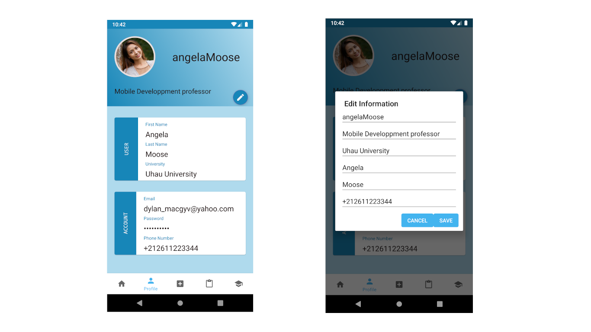
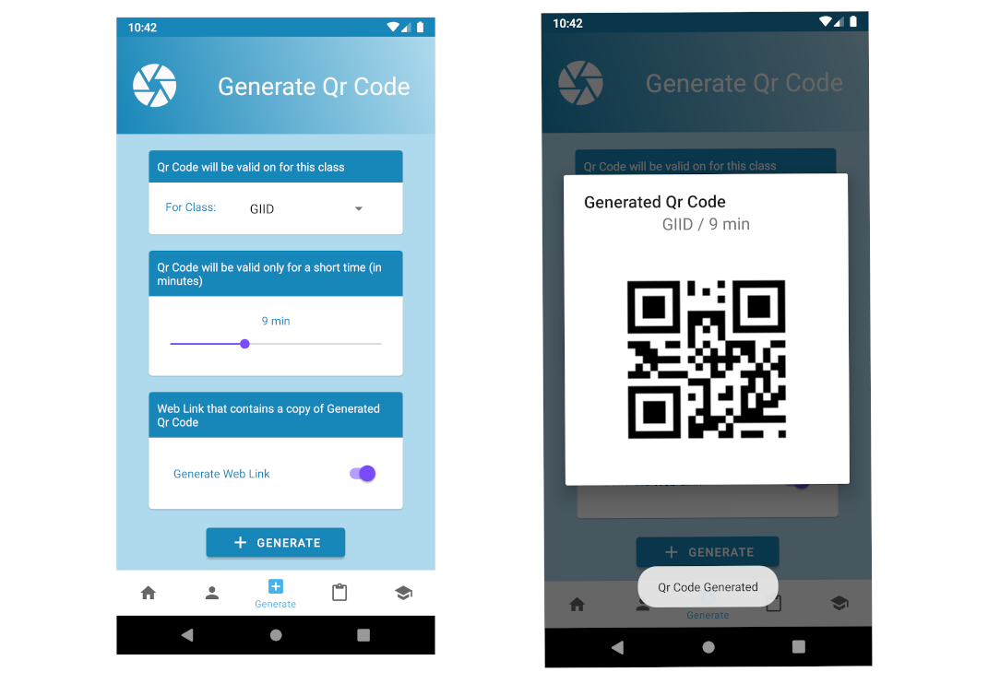
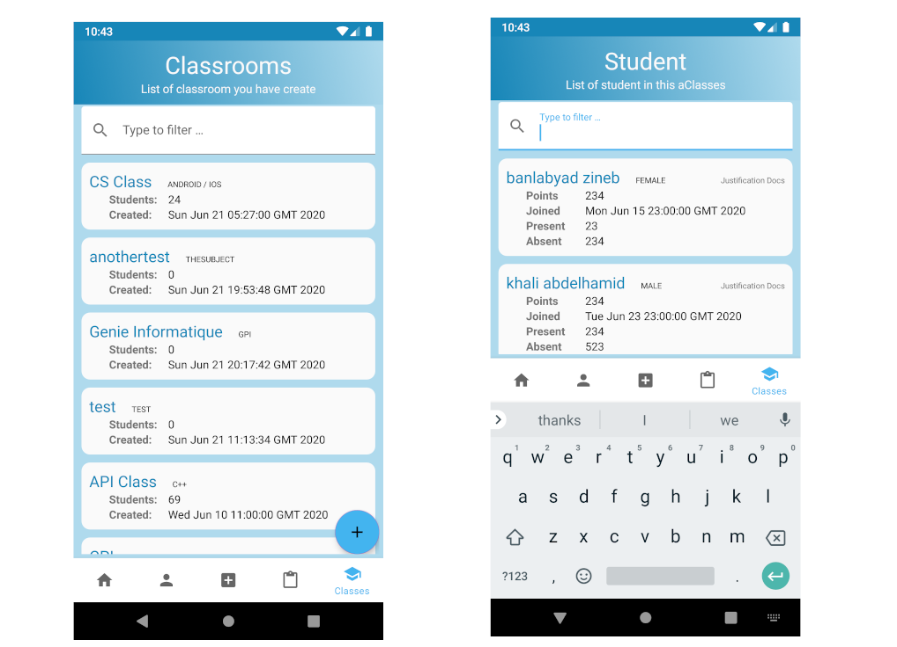

# Attendance Monitor 
An android application that could help professors manage student presence (using QrCode) and absence justification easily, besides grades and courses.

# :thinking: why ?
This is was initially a school project. 

# :camera: Screenshots

# :hammer: Usage
how to use this project
# :computer: Installation
**Prerequisites**
Before you continue, make you sure you have met the following requirements:

* You have installed android studio and java
* You have a basic understanding android developement
* You have a firebase project and a basic understanding of firebase

**Installation**
1. Open the project in android studio.
2. setup firebase configuration metadata.
3. run the project in development mode.

# :heavy_check_mark: Todo

- [ ] Statistic UI and support
- [ ] Justification implementation ( UI / Backend)
- [ ] Remove classroom by swiping
- [ ] Student Support (Front / back)
- [ ] Server Side : Manage invitation codes for classrooms

# :wave: Contact
If you want to contact me, you can reach me ablil@protonmail.com
